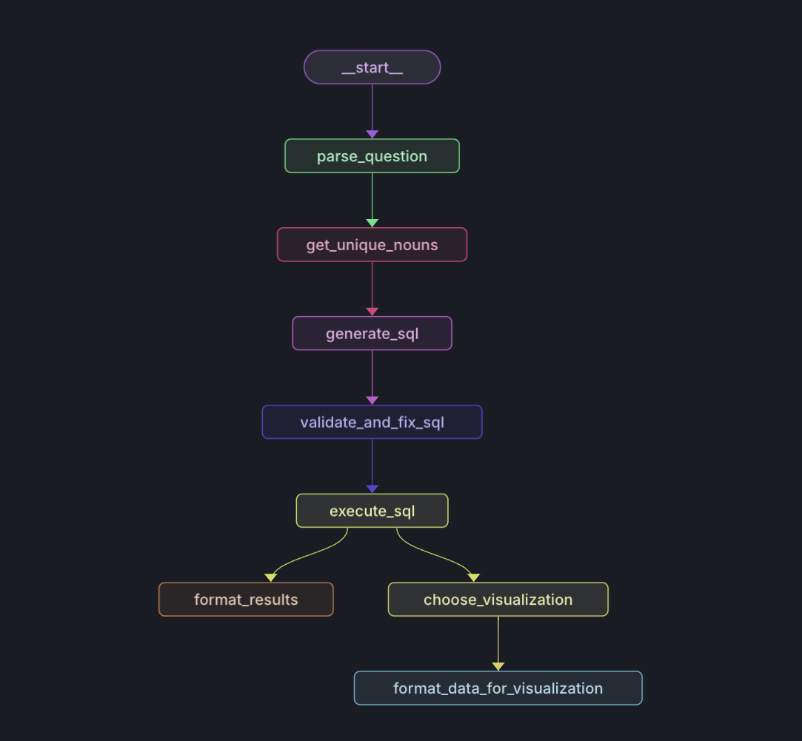

This project implements an intelligent SQL agent with a structured workflow for processing natural language questions, generating SQL queries, and providing visualizations. Here are the other repositories for the project:

- [Frontend](https://github.com/DhruvAtreja/data-visualization-frontend)
- [Server to handle .sqlite and .csv files](https://github.com/DhruvAtreja/sqllite-server)

The project is deployed [here](https://data-visualization-frontend-gamma.vercel.app/).

## Features

- SQL query generation and validation
- Query execution and result formatting
- Visualization recommendation and data formatting
- Streaming LangGraph state

## Main Components

### WorkflowManager

The `WorkflowManager` class is responsible for creating and managing the workflow of the SQL agent. It uses LangGraph's `StateGraph` to define the sequence of operations.

Key methods:

- `create_workflow()`: Sets up the workflow graph with various nodes and edges.
- `run_sql_agent()`: Executes the entire workflow for a given question.

### SQLAgent

The `SQLAgent` class (not shown in the provided code) likely contains the implementation of individual steps in the workflow, such as:

- Parsing questions
- Generating SQL queries
- Validating and fixing SQL
- Executing SQL queries
- Choosing visualizations

### DataFormatter

The `DataFormatter` class is responsible for formatting the data for the chosen visualization type.

Key methods:

- `format_data_for_visualization()`: Formats the data for the chosen visualization type.

## Usage

To use the SQL agent:

1. Install and run docker
2. Install the required dependencies listed in `requirements.txt`.
3. Set up the environment variables by creating a `.env` file with the correct keys.
4. Use 'langgraph up', you will get a local url to access the api
